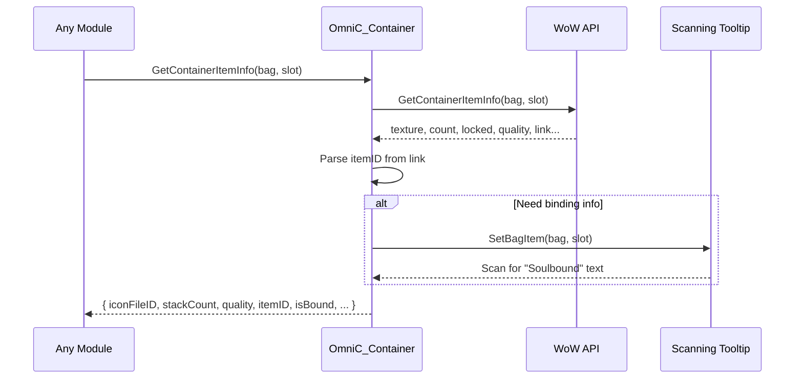

# Feature: API Shim Layer

## Purpose

The API Shim provides a compatibility layer that translates WoW 3.3.5a (WotLK) inventory APIs to a modern table-based format, enabling forward-compatible code that will work on Retail with minimal changes.

## Related

- ADR: [ADR-001: API Shim Architecture](../ADR/ADR-001-api-shim-architecture.md)
- Code: `Omni/API.lua`

---

## Business Rules

1. All inventory data access MUST go through `OmniC_Container` namespace
2. Legacy WoW APIs (`GetContainerItemInfo`, etc.) are NEVER called directly by other modules
3. Return values match Retail `C_Container` table structure
4. Missing data (itemID, isBound) is synthesized from link parsing and tooltip scanning

---

## Main Flow

---

## API Reference

### OmniC_Container.GetContainerItemInfo(bagID, slotID)

Returns a table with item information or `nil` if slot is empty.

| Field | Type | Description |
|-------|------|-------------|
| iconFileID | string | Texture path |
| itemID | number | Parsed from itemLink |
| hyperlink | string | Full item link |
| stackCount | number | Current stack size |
| isLocked | boolean | Item is locked |
| quality | number | 0=Poor to 5=Legendary |
| isBound | boolean | Soulbound status |
| bagID | number | Source bag |
| slotID | number | Source slot |

### OmniC_Container.GetContainerNumSlots(bagID)

Returns total slots in the bag.

### OmniC_Container.GetContainerFreeSlots(bagID)

Returns free slot count and bag type.

### OmniC_Container.GetAllBagItems()

Returns array of all item info tables from bags 0-4.

### OmniC_Container.GetAllBankItems()

Returns array of all item info tables from bank and bank bags.

---

## Test Flows

### Positive Flow: Get Valid Item

**Precondition:** Bag 0, Slot 1 contains an item

1. Call `OmniC_Container.GetContainerItemInfo(0, 1)`
2. Verify return is a table
3. Verify `iconFileID` is not nil
4. Verify `itemID` is a number > 0
5. Verify `stackCount` >= 1

**Expected:** Table with all fields populated

### Negative Flow: Empty Slot

**Precondition:** Bag 0, Slot 1 is empty

1. Call `OmniC_Container.GetContainerItemInfo(0, 1)`
2. Verify return is `nil`

**Expected:** Returns nil, no error

### Edge Case: Soulbound Detection

**Precondition:** Character has a Soulbound item

1. Call `OmniC_Container.GetContainerItemInfo` for that slot
2. Verify `isBound == true`

**Expected:** Correctly identifies soulbound items

---

## Definition of Done

- [x] `Omni/API.lua` created with OmniC_Container namespace
- [x] GetContainerItemInfo returns modern table structure
- [x] itemID parsed from link
- [x] Tooltip scanning implemented for binding detection
- [x] Client version detection included
- [x] ADR documented
- [ ] In-game verification complete
